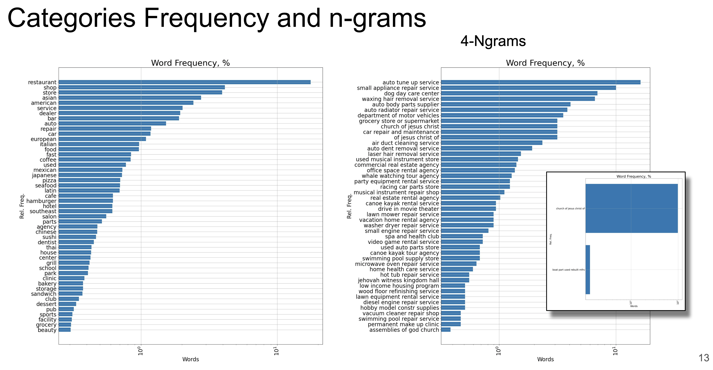

# [Google Local News Content-based Recommender](https://docs.google.com/presentation/d/1QKpEJZxsz7VvZhyjyRCmVpDFfDcbT5D-QfCfP0AfMNw/edit?usp=sharing)

* [Developers Manual](Developers_Manual.md)
* [Presentation](https://docs.google.com/presentation/d/1QKpEJZxsz7VvZhyjyRCmVpDFfDcbT5D-QfCfP0AfMNw/edit?usp=sharing)

## High level description of project
Build a recommender(s) using a [Google Local News](https://cseweb.ucsd.edu/~jmcauley/datasets.html#google_local) database, deploy on AWS using Spark, finalize on the web using Flask. Explore scalability and performance.<br />
## Data Source(s)
* [Places Data](http://deepyeti.ucsd.edu/jmcauley/datasets/googlelocal/places.clean.json.gz),
(3,114,353, 8)<br /> 'name', 'price', 'address', 'hours', 'phone', 'closed', **'gPlusPlaceId'**, **'gps'**

* [User Data](http://deepyeti.ucsd.edu/jmcauley/datasets/googlelocal/users.clean.json.gz), _**NOT USED**_<br /> (3,747,937, 6)<br />
'userName', 'jobs', 'currentPlace', 'previousPlaces', 'education', 'gPlusUserId'
* [Review Data](http://deepyeti.ucsd.edu/jmcauley/datasets/googlelocal/reviews.clean.json.gz)<br />(11,453,845, 8)<br />
**'rating'**, 'reviewerName', **'reviewText'**, **'categories'**, **'gPlusPlaceId'**, 'unixReviewTime', **'reviewTime'**, 'gPlusUserId'<br />Period of ~24 years December 30, 1990 ~ March 29, 2014


## Description of Data
- These datasets contain reviews about businesses from Google Local (Google Maps). Data includes geographic information for each business as well as reviews.<br />
* [Original data files](https://cseweb.ucsd.edu/~jmcauley/datasets.html#google_local) for example [places.clean.json.gz](http://deepyeti.ucsd.edu/jmcauley/datasets/googlelocal/places.clean.json.gz) can not be read using
    `df_places = pd.read_json('data/places.clean.json)`, since file is a a collection of dictionary rows. Refer [json_convert.py](src/json_convert.py) for details
* Data contains a fair amount of noise, specifically:
    * gPlusPlaceId does not match between places and reviews [](). While current syntax is an alpha-numeric string like this: [ChIJgUbEo8cfqokR5lP9_Wh_DaM](https://developers.google.com/maps/documentation/places/web-service/place-idu), data files contain 20-ALL-DIGITS gPlusPlaceId like this:
    * gPlusPlaceId 118197036100848205824.0 in reviews vs
    * gPlusPlaceId 118197036100000006144.0 from places_gps.json
    This particular gPlusPlaceId happens to belong to the most reviewed place in the world - Eiffel Tower with 1662 ratings, yet consistent gPlusPlaceId in the reviews database does not match same index in places. Code in [~](src/Alexey.ipynb) corrects this by creating a matching index
    * ~ 2.5% of gps data are "out in space" ~ 81 times further than Mars. The scaling error is a simple 1/1e6, and is consistent. It can be discovered by checking values of lattitude and longitude (supplied in a list) for abs(latitude) <= 180, and abs(longitude) <= 90
    * There are cases of identical gPlusPlaceId that belong to different places: gPlusPlaceId= (to be updated), though relative volume of data is small, and can be discarded without sacrificing significant portion of the data.


## Sources:
* [[1](https://cseweb.ucsd.edu/~jmcauley/datasets.html#google_local)], [[2](http://cseweb.ucsd.edu/~jmcauley/pdfs/recsys18a.pdf)], [[3](http://cseweb.ucsd.edu/~jmcauley/pdfs/recsys17.pdf)]<br />

## Papers:
* [Translation-based Factorization Machines for Sequential Recommendation](http://cseweb.ucsd.edu/~jmcauley/pdfs/recsys18a.pdf),
* [Translation-based Recommendation](http://cseweb.ucsd.edu/~jmcauley/pdfs/recsys17.pdf)


# Data Processing
## dictionary-like json conversion
Original data *.clean.json files are rows of dictionaries, that would not import using standard pandas
```
df=pd.read_json('../data/places.clean.json')
```

* [json_convert.py](src/json_convert.py) this script reads, processes, and saves original json files in pandas readable format. total run time 1h 43 minutes
```
base) alexey_imac@ALEXEYs-iMac src % python json_convert.py
STEP 1 df_places load time: 2.7260870933532715
STEP 2 df_places explode time: 816.2096629142761
STEP 3 df_places save json time: 13.365344047546387
STEP 4 df_places reload from json time: 39.496094942092896
STEP 1 df_reviews load time: 7.131134986877441
STEP 2 df_pdf_reviews explode time: 4040.660280942917
STEP 3 df_reviews save json time: 117.0224997997284
STEP 4 df_reviews reload from json time: 153.501229763031
STEP 1 df_users load time: 1.5642907619476318
STEP 2 df_users explode time: 934.1211636066437
STEP 3 df_users save json time: 11.650207996368408
STEP 4 df_users reload from json time: 39.83325409889221
Conversion total time: 6183.85197520256
(base) alexey_imac@ALEXEYs-iMac src %
```
## EDA
### Locations





# Recommender
## Initialization with keyword / search


